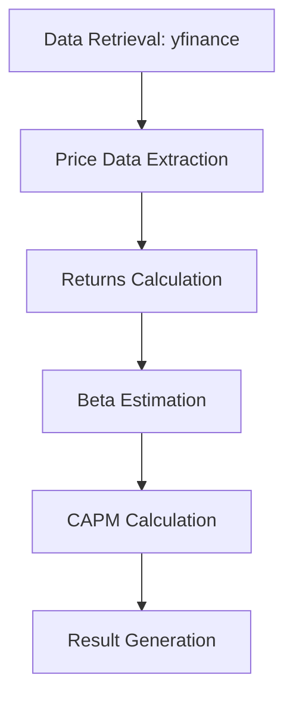
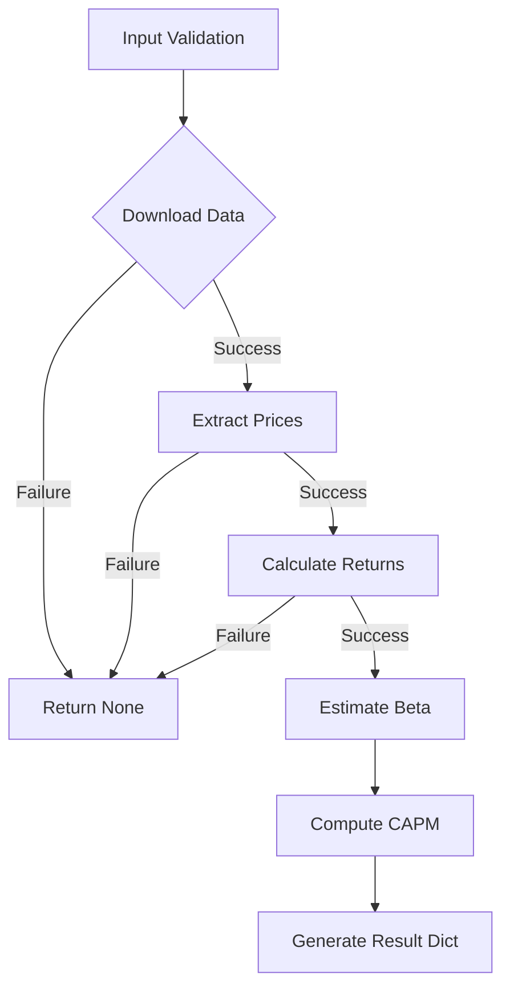

# Technical Documentation: CAPM Model Implementation

This document provides a detailed explanation of how the CAPM (Capital Asset Pricing Model) implementation works, breaking down each component and their interactions.

## Quick Reference

Key files in this project:
- `capm_model.py`: Core implementation of the CAPM model
- `README.md`: User documentation and setup instructions
- `TECHNICAL.md`: This file - detailed technical documentation
- `requirements.txt`: Project dependencies

## Core Components Overview



## 1. Data Retrieval and Processing

### Function: `_extract_adj_close()`
Internal helper that handles various yfinance return formats:

```python
def _extract_adj_close(df: pd.DataFrame) -> Optional[pd.DataFrame]:
```

#### Data Format Handling:
1. **Series Data**
   - Handles single-ticker responses
   - Converts to DataFrame with proper column naming

2. **MultiIndex DataFrame**
   - Processes typical yfinance multi-level columns
   - Navigates hierarchical indexes to find adjusted close prices
   - Falls back to flattened column names if needed

3. **Single-level DataFrame**
   - Direct column access for simple structures
   - Handles pre-filtered price data

#### Error Prevention:
- Checks for None/empty DataFrames
- Validates column existence
- Ensures proper ticker alignment
- Returns None on extraction failure

## 2. Returns Calculation

The main function supports two return calculation methods:

### Simple Returns
```python
returns = data.pct_change().dropna()
# (P₁ - P₀) / P₀
```

### Logarithmic Returns
```python
returns = np.log(data / data.shift(1)).dropna()
# ln(P₁/P₀)
```

#### Properties:
- Log returns are more suitable for statistical analysis (more normal-like)
- Simple returns are more intuitive and directly compound
- Both methods align dates and handle missing data

## 3. Beta Estimation

Uses scipy's linear regression to estimate beta:

```python
lr = stats.linregress(market_returns, stock_returns)
beta = lr.slope  # Beta coefficient
alpha = lr.intercept  # Jensen's alpha
r_squared = lr.rvalue ** 2  # Goodness of fit
```

### Statistical Components:
- **Beta (β)**: Measures systematic risk
- **Alpha (α)**: Excess return over what CAPM predicts
- **R²**: Explains variation explained by market movements
- **Standard Error**: Provides confidence in beta estimate

## 4. Return Annualization

Supports two methods of annualizing returns:

### Arithmetic Annualization
```python
# For simple returns
annual_return = daily_return * annualization

# For log returns
annual_return = (np.exp(daily_return) - 1) * annualization
```

### Geometric Annualization
```python
# For simple returns
annual_return = (1 + daily_return) ** annualization - 1

# For log returns
annual_return = np.exp(daily_return * annualization) - 1
```

#### Use Cases:
- Arithmetic: Better for short horizons and expected return estimation
- Geometric: Better for longer horizons and realized return calculation

## 5. CAPM Calculation

The core CAPM formula implementation:

```python
market_risk_premium = market_annual_return - risk_free_rate
expected_return = risk_free_rate + beta * market_risk_premium
```

### Components:
- **Risk-free rate**: Annual rate (e.g., Treasury yield)
- **Market risk premium**: Excess market return over risk-free rate
- **Beta-adjusted premium**: Scaled by stock's systematic risk

## Data Flow and Error Handling



### Error Checks:
1. **Data Sufficiency**
   ```python
   if data.shape[0] < 2:
       return None  # Insufficient observations
   ```

2. **Market Variance**
   ```python
   if market_returns.var() == 0:
       return None  # Cannot compute beta
   ```

3. **Data Quality**
   ```python
   data = data.dropna(how="any")  # Ensure aligned observations
   ```

## Result Structure

The function returns a comprehensive dictionary:
```python
{
    "expected_return": float,    # Annual expected return
    "beta": float,              # Systematic risk
    "alpha": float,             # Jensen's alpha
    "beta_stderr": float,       # Beta standard error
    "r_squared": float,         # Regression R-squared
    "market_annual_return": float,  # Annualized market return
    "market_risk_premium": float,   # Market premium
    "n_obs": int               # Sample size
}
```

## Usage Considerations

### Performance Optimization:
- Uses vectorized operations for returns calculation
- Efficient date alignment with pandas
- Minimal data copying

### Statistical Robustness:
- Handles outliers through regression
- Reports confidence measures
- Supports different return calculations

### Data Quality:
- Robust to various API responses
- Validates data sufficiency
- Preserves temporal alignment

## Implementation Notes

1. **Default Parameters**
   - 252 trading days per year
   - Arithmetic annualization
   - Simple returns
   - Verbose output enabled

2. **Data Requirements**
   - Minimum 2 observations
   - Non-zero market variance
   - Matched dates for stock and market

3. **Extensibility**
   - Modular design for easy modification
   - Clear separation of concerns
   - Documented failure modes

This implementation balances:
- Statistical rigor
- Numerical stability
- User flexibility
- Error resilience